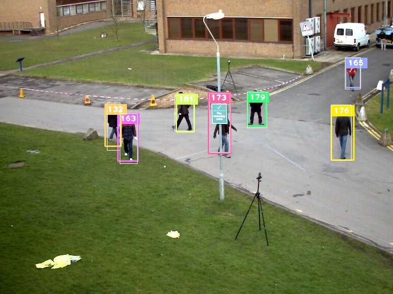

## SORT in C++

This is my implementation of the 2016 by A. Bewley proposed
[SORT](https://github.com/abewley/sort) tracking algorithm.

Another C++ implementation? Boring. Possibly. But since I wanted to learn some
C++ this was an interesting project. Also, the other implementations didn't
always work for me.

This implementation runs at ridiculously ~28.000FPS on the
[2D MOT 2015](https://motchallenge.net/data/2D_MOT_2015/) Dataset on an AMD 
Ryzen7 3700X with 64GB RAM - pheeewww. Maybe something is wrong with my 
timing...

### Dependencies
The following external libraries are needed:
- [OpenCV](https://www.opencv.org) for the Kalman filter and the bounding box.
- [dlib](http://www.dlib.net) for the linear assignment problem.

If you are on an ArchLinux based system like me, install opencv from the
official repository:
```
$ sudo pacman -S opencv glu glew hdf5 vtk
```
dlib can be obtained from the [aur](https://aur.archlinux.org/packages/dlib/).

On Ubuntu based distributions simply install them with:
```
$ sudo apt-get install libopencv-dev libdlib-dev
```

### Build

I use cmake for the build process.

```
$ git clone https://github.com/tylernewnoise/SORT_in_Cpp.git
$ cd SORT_in_Cpp
$ mkdir build && cd build
$ cmake .. -DCMAKE_BUILD_TYPE=Release
$ make
```

### Demo

Download the [2D MOT 2015](https://motchallenge.net/data/2D_MOT_2015/) data set
and put it in this folder structure:
```
SORT
  └─ data
    └─ Sequence
      ├─ det
      ├─ gt
      └─ train
```
Run
```
$./SORT -d
```
inside the ``SORT`` directory to get a visualization with neat bounding boxes.
Omit the ``-d`` to run the tracker offline. Exchange the det.txt files with
Alex's [detections](https://github.com/abewley/sort/tree/master/data/train) to 
get better results.
Use [py-motmetrics](https://github.com/cheind/py-motmetrics) to evaluate the
results which are written to ``output/Sequence.txt``.

I tested and wrote this on AchLinux, for other operating system changes may
have to be made.

Sample output:



### Usage

Functionality is written in a single header file for simple usage in other 
projects, just import the header with :
```C++
#import sort.h
```
Detections have to be passed as ``std::vector<cv::Rect_<float>>``. Tracks are 
returned as ``std::vector<struct Track>``.
See the 
[demo.cpp](https://github.com/tylernewnoise/SORT_in_Cpp/blob/main/src/demo.cpp#L120)
for an example.

### Results

I used Alex's [detections](https://github.com/abewley/sort/tree/master/data/train)
and [py-motetrics](https://github.com/cheind/py-motmetrics) for evaluation:

Sequence       | Rcll  |  Prcn |  GT | MT | PT |   ML |  FP  |   FN | IDs |   FM | MOTA  |  MOTP
-------------- |:-----:|:-----:|:---:|:---:|:---:|:---:|:---:|:----:|:---:|:----:|:-----:|:------
ADL-Rundle-6   | 58.1% | 76.0% |  24 |   7 |  15 |   2 | 919 | 2101 |  75 |  107 | 38.2% |  74.6%
TUD-Stadtmitte | 75.2% | 97.5% |  10 |   6 |   4 |   0 |  22 |  287 |  10 |   16 | 72.4% |  75.2%
ETH-Bahnhof    | 66.1% | 76.8% | 171 |  50 |  62 |  59 |1083 | 1835 |  60 |  141 | 45.0% |  74.2%
ETH-Pedcross2  | 52.5% | 90.1% | 133 |  14 |  62 |  57 | 360 | 2974 |  73 |  116 | 45.6% |  74.7%
KITTI-17       | 69.5% | 92.8% |   9 |   1 |   8 |   0 |  37 |  208 |   8 |   15 | 63.0% |  72.0%
ADL-Rundle-8   | 46.4% | 75.0% |  28 |   8 |  15 |   5 |1050 | 3637 | 101 |  246 | 29.4% |  70.9%
ETH-Sunnyday   | 78.5% | 81.4% |  30 |  12 |  15 |   3 | 334 |  399 |  23 |   57 | 59.3% |  74.3%
KITTI-13       | 40.7% | 70.5% |  42 |   0 |  32 |  10 | 130 |  452 |  16 |   24 | 21.5% |  68.5%
Venice-2       | 42.7% | 64.3% |  26 |   8 |  10 |   8 |1698 | 4089 |  59 |  111 | 18.1% |  73.6%
PETS09-S2L1    | 76.3% | 86.9% |  19 |   8 |  11 |   0 | 515 | 1062 | 100 |  192 | 62.5% |  67.7%
TUD-Campus     | 68.2% | 93.2% |   8 |   4 |   4 |   0 |  18 |  114 |   5 |   13 | 61.8% |  73.5%
**OVERALL**    | 57.0% | 78.7% | 500 | 118 | 238 | 144 |6166 |17158 | 530 | 1038 | 40.2% |  72.7%
 
### Resources

SORT paper, describing the original Simple Online and Realtime Tracking method:

```
@inproceedings{sort2016,
    author = {Bewley, Alex and Ge, Zongyuan and Ott, Lionel and Ramos, Fabio and Upcroft, Ben},
    booktitle = {2016 IEEE International Conference on Image Processing (ICIP)},
    title = {Simple online and realtime tracking},
    year = {2016},
    pages = {3464-3468}
}
```
Also checkout [nwojke](https://github.com/nwojke) 's
[DeepSORT](https://github.com/nwojke/deepsort) implementation.

Other C++ implementations:

- [samuelmurray](https://github.com/samuelmurray/tracking-by-detection)
- [yasenh](https://github.com/yasenh/sort-cpp)
- [mcxmiming](https://github.com/mcximing/sort-cpp)
